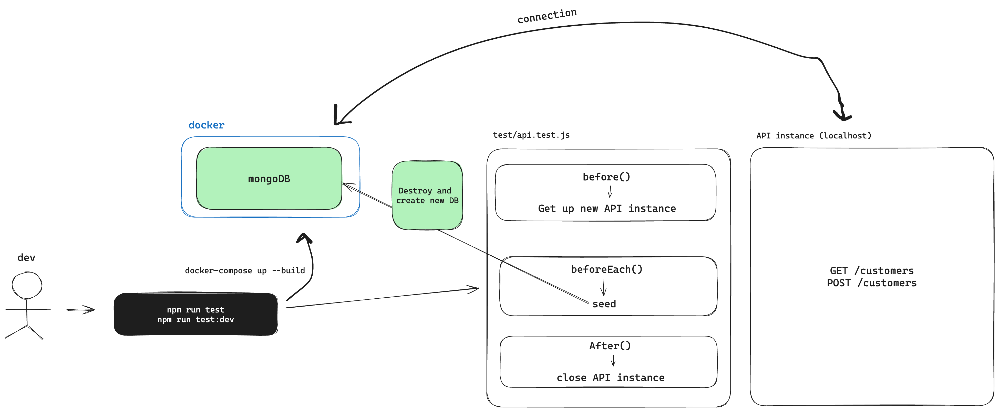

# Tests end to end with Database (mongodb)

Reference: [https://www.youtube.com/watch?v=x2C-n5ybyqQ&t=10s](https://www.youtube.com/watch?v=x2C-n5ybyqQ&t=10s)

- Use the debugging setup to check the value inside variables
- When you change code in a hot reload, your changes will be applied in the docker container
- Execute your tests in a independent way
    - In each case of test, you will up a new server instance, because if you application have somthing in memory, a test will never affect other test
- Before each test, you will create a new database for each test and clean the last one used
- You can have a lot of test cases in the same route